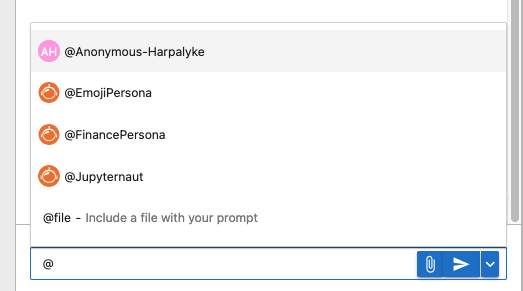
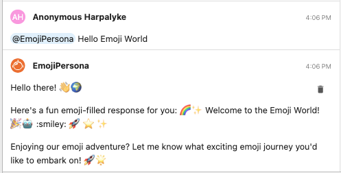

# Jupyter AI Personas

It is now possible to develop Personas that can handle various custom actions when given instructions in natural language. Multiple AI personas may be added per chat. Personas are analogous to "bot accounts" as in other chat applications such as Slack or Discord. A persona may be as extensive as an agentic system comprising multiple agents that use a wide variety of tools, and have multi-faceted heirarchies. 

"Jupyternaut" has been redefined as a default AI persona provided by Jupyter AI. Jupyternaut will use the same interface as every other AI persona.

Jupyternaut will only reply when @-mentioned in the chat. Similarly, all AI personas, including Jupyternaut, will only reply when @-mentioned. This allows users to precisely control when and which AI personas respond.

This also enables future work surrounding multi-agent collaboration (MAC). AI personas are able to @-mention each other to dispatch tasks or use agentic tools only available through another persona.

The Personas feature allows other packages to add fully-custom AI personas. Developers can define the name, avatar, and how new messages are handled. Custom AI personas can use any AI model or AI library of their choice, and now have full control over how new messages are handled.

## Installation

First clone the repo or your fork of the repo:
```
git clone https://github.com/jupyter-ai-contrib/jupyter-ai-personas.git
```
or
```
git clone https://github.com/<github-username>/jupyter-ai-personas.git
```

Create an environment for installing the Personas package. Run the following from the root of the repo folder:
```
cd jupyter-ai-personas
conda env create -f dev-environment.yml
```

Activate the environment: 
```
conda activate jai-personas
```

Install all personas:
```
pip install -e ".[all]"
```

Or, just install required dependencies only:
```
pip install -e .
```

Or, install a specific persona as:
```
pip install -e ".[<optional-dependencies>]"
```
| persona  | optional-dependencies |
| :-------------: | :-------------: |
| finance_persona | finance  |
| emoji_persona  | emoji  |
| software_team_persona  | software_team |

## Example: The Emoji Persona

It is fitting that emojis personify "Hello World!" -- as shown below. 
Use the `@` prefix to pop up the available personas and then select one. Enter the prompt.



This will display the result with the name of the persona in the chat:



## Building Personas

You may use any of the personas in this repository as templates and guides to building your own personas!

A bare bones persona may be found in the Jupyter AI repository [here](https://github.com/jupyterlab/jupyter-ai/blob/main/packages/jupyter-ai-test/jupyter_ai_test/debug_persona.py).It is reproduced below: 

```python
from jupyter_ai.personas.base_persona import BasePersona, PersonaDefaults
from jupyterlab_chat.models import Message, NewMessage


class DebugPersona(BasePersona):
    """
    The Jupyternaut persona, the main persona provided by Jupyter AI.
    """

    def __init__(self, *args, **kwargs):
        super().__init__(*args, **kwargs)

    @property
    def defaults(self):
        return PersonaDefaults(
            name="DebugPersona",
            avatar_path="/api/ai/static/jupyternaut.svg",
            description="A mock persona used for debugging in local dev environments.",
            system_prompt="...",
        )

    async def process_message(self, message: Message):
        self.ychat.add_message(NewMessage(body="Hello!", sender=self.id))
        return
```

Make a copy of this, change the class name, and then build more functionality into it. 
