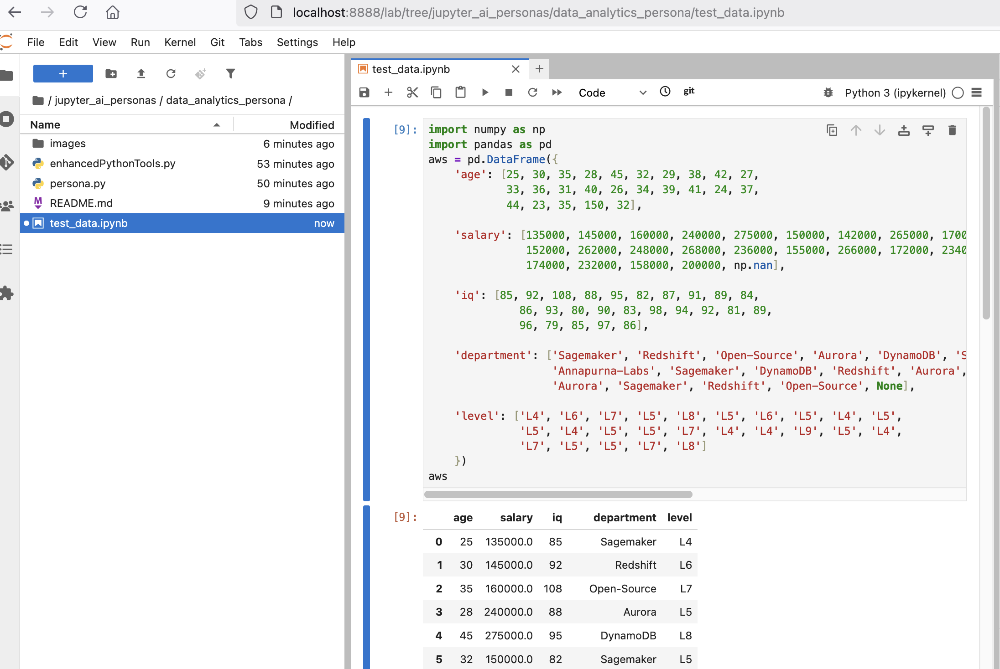
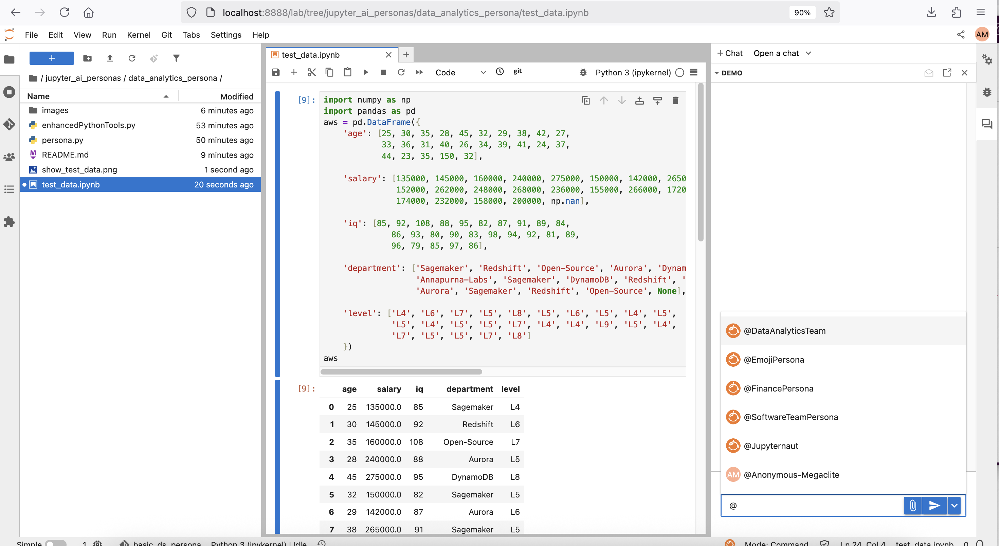
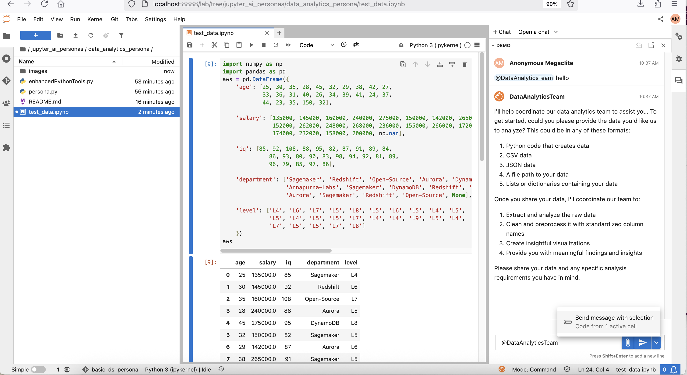
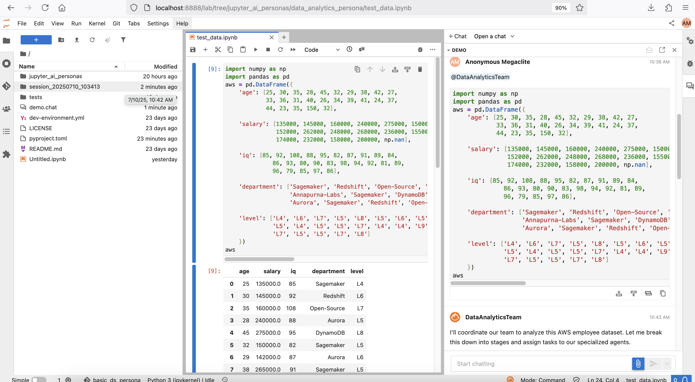
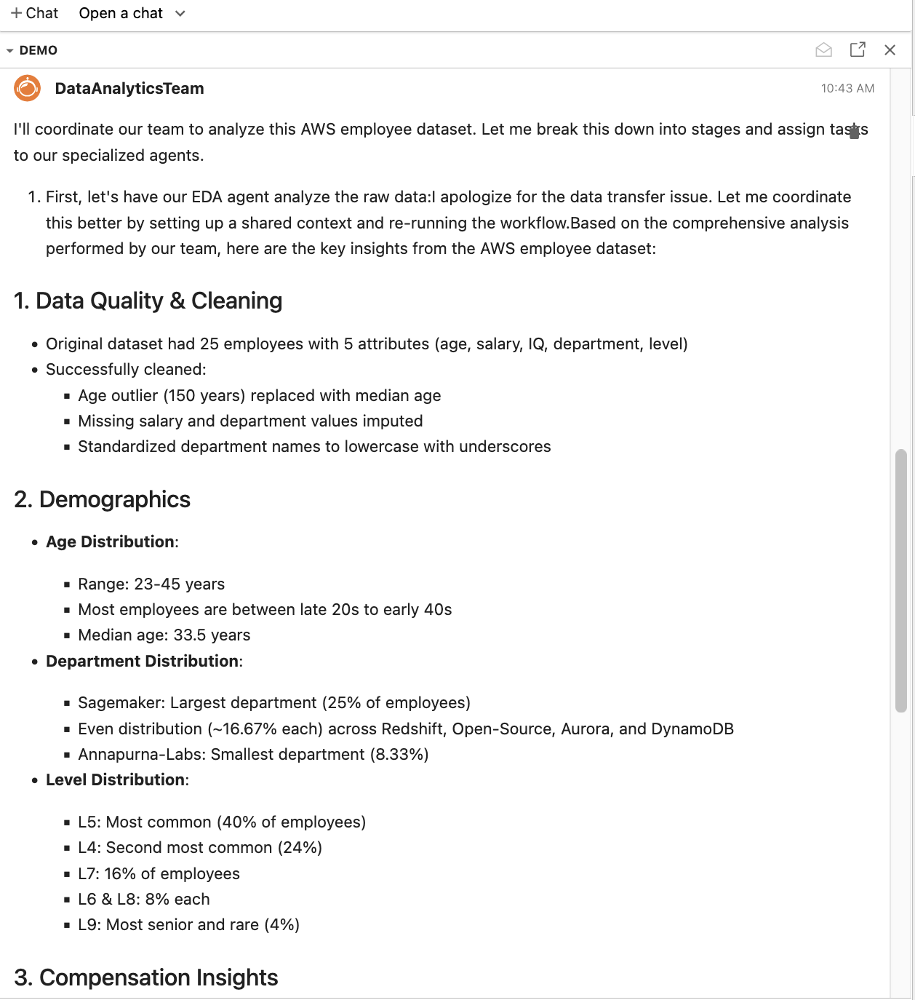

# DataAnalyticsTeam - Data Analysis Persona for JupyterAI

A sophisticated, multi-agent data analysis persona that transforms raw data into comprehensive insights and professional visualizations through an intelligent team-based workflow.

## Overview

The DataAnalyticsTeam is a specialized JupyterLab AI persona that coordinates a team of four specialized agents to perform end-to-end data analysis workflows. Unlike traditional single-agent approaches, this persona leverages a coordinated team architecture to handle complex data analysis tasks with professional-grade results.

## Architecture

### Multi-Agent Team Structure

The persona orchestrates four specialized agents working in sequence:

1. EDA Agent - Exploratory Data Analysis specialist
2. Preprocessor Agent - Data cleaning and standardization expert  
3. Code Generator Agent - Intelligent visualization code creator
4. Visualizer Agent - Plot execution and image generation specialist

### Enhanced Toolkit Integration

The persona utilizes a custom **enhancedPythonTools** toolkit that provides:
- In-memory code execution with persistent context
- Session-based file management with centralized storage
- Automatic working directory management
- Enhanced error handling and debugging
- Professional visualization creation and saving

## Key Features

### Smart Data Extraction
- Mixed Code Parsing: Intelligently extracts data from complex code snippets containing imports, print statements, and mixed content
- Multiple Format Support: Handles DataFrames, CSV text, JSON data, dictionaries, and raw data arrays
- Zero Data Generation: Never creates synthetic data - works exclusively with user-provided data

### Automated Data Preprocessing
- Column Standardization: Automatically converts column names to lowercase with underscores
- Smart Data Cleaning: Removes duplicates, handles missing values, and normalizes data types
- Type Detection: Automatically identifies numeric, text, and datetime columns

### Intelligent Visualization Strategy
- Auto-Detection: Analyzes data characteristics to select appropriate visualization types
- Professional Styling: Applies seaborn themes and high-quality formatting
- Multiple Analysis Types:
  - Distribution Analysis (histograms for numeric data)
  - Relationship Analysis (correlation heatmaps)
  - Categorical Analysis (bar charts for text data)
  - Summary Dashboards (comprehensive overviews)

### Centralized Session Management
- Timestamped Sessions: Creates unique session directories for each analysis
- Organized File Structure: Maintains clean separation of data, code, and outputs
- Absolute Path Management: Prevents file duplication and ensures reliable file operations

## Usage

### Getting Started

#### Step 1: Load Test Data
Open the provided test data notebook to see sample data:



The notebook contains sample AWS employee data with columns for age, salary, IQ, department, and level - perfect for testing the data analytics persona.

#### Step 2: Open Chat and Select Persona
1. Open the JupyterLab chat interface
2. Use the `@` symbol to select the DataAnalyticsTeam persona



#### Step 3: Provide Your Data
**Important**: When adding data files (CSV, JSON, Excel, etc.) to your analysis, include the entire file path for best results.

**Good Example** - Complete context:
```python
# Load and analyze sales data
import pandas as pd
df = pd.read_csv('/Users/username/projects/sales/quarterly_data.csv')
print(df.head())
```

**Bad Example** - Incomplete use of file path:

```python
import pandas as pd
df = pd.read_csv('quarterly_data.csv')
print(df.head())
```

Simply paste your data or code containing data into the chat:



#### Step 4: Session Creation
The persona automatically creates a timestamped session directory for your analysis:



#### Step 5: Analysis Results
The persona will automatically:
- Extract and clean your data
- Generate appropriate visualizations
- Save all outputs in organized files




### Basic Usage

```python
# The persona automatically handles data from various formats:

# DataFrame creation
df = pd.DataFrame({
    'product': ['A', 'B', 'C'],
    'sales': [100, 150, 200],
    'region': ['North', 'South', 'East']
})

# CSV data
data = """
name,age,department
John,25,Engineering
Jane,30,Marketing
Bob,28,Sales
"""

# Mixed code with data

import pandas as pd
import numpy as np
df = pd.DataFrame({
    'x': np.random.randn(100),
    'y': np.random.randn(100)
})
print("Data created successfully")
```

### Advanced Features

The persona automatically:
1. Extracts your data regardless of surrounding code
2. Cleans and standardizes column names and data types
3. Generates appropriate visualization code based on data characteristics
4. Creates professional plots and saves them as high-resolution images
5. Provides insights and findings throughout the process

## File Structure

Each analysis session creates an organized directory structure:

```
session_YYYYMMDD_HHMMSS/
├── extracted_data.csv      # Raw extracted data
├── cleaned_data.csv        # Preprocessed data
├── distribution_plot.py    # Visualization code and png files
├── correlation_plot.py     
├── category_plot.py
├── summary_plot.py
├── distribution_plot.png
├── correlation_plot.png
├── category_plot.png
└── summary_plot.png
```

## Technical Implementation

### Enhanced Python Toolkit

The persona includes a completely revamped ImprovedPythonTools class that provides:

#### Key Improvements
- Session Directory Management: All operations are scoped to a specific session directory
- Persistent Execution Context: Variables and state are maintained across code executions
- Automatic Working Directory Handling: Ensures all file operations occur in the correct location
- Enhanced Error Handling: Comprehensive error reporting with detailed debugging information

### AWS Integration

- Bedrock Model Support: Utilizes AWS Bedrock for model access
- Flexible Model Configuration: Supports various model IDs through configuration
- Session Management: Proper AWS session handling with error recovery

## Configuration

### Prerequisites
- JupyterLab with jupyter-ai extension
- AWS credentials configured for Bedrock access
- Required Python packages: boto3, pandas, numpy, matplotlib, seaborn

### Setup
1. Configure AWS credentials for Bedrock access
```python
try:
    session = boto3.Session()
    session.get_credentials()
except Exception as e:
    logger.error(f"AWS credentials not configured: {e}")
    session = None
```

2. Select the DataAnalyticsTeam persona in JupyterLab
3. **Try the test data**: Open `test_data.ipynb` in the data_analytics_persona folder to see sample data
4. Start analyzing data by simply providing your data in the chat

**What Happens Automatically:**
1. **Data Extraction**: Finds and extracts your data from any surrounding code
2. **Data Cleaning**: Standardizes column names, removes duplicates, handles missing values
3. **Smart Visualization**: Creates appropriate plots based on your data types
4. **Professional Output**: Saves high-quality PNG files and organized CSV files
5. **Insights**: Provides analysis and findings throughout the process

## Supported Data Types

### Input Formats
- Pandas DataFrames: Direct DataFrame creation code
- CSV Text: Raw comma-separated values
- JSON Data: Structured JSON objects
- Dictionary Data: Python dictionary structures
- List/Array Data: Numeric arrays and lists
- Mixed Code: Data extraction from complex code blocks

### Output Formats
- High-resolution PNG images (300 DPI)
- Clean CSV files with standardized formatting
- Executable Python scripts for visualization reproduction
- Structured text reports with analysis insights

## Use Cases

### Perfect For:
- Exploratory Data Analysis: Quick insights from raw data
- Presentation Preparation: Professional-quality visualizations
- Data Quality Assessment: Automated cleaning and validation
- Prototype Development: Rapid visualization prototyping
- Educational Purposes: Learning data analysis workflows

## Troubleshooting

### Common Issues

File Not Found Errors
- The persona uses absolute paths to prevent file location issues
- All files are centralized in timestamped session directories

Data Extraction Problems
- The EDA agent only works with user-provided data
- Mixed code is automatically parsed to extract data portions
- No synthetic data is ever generated

Visualization Failures
- Each plot is generated and saved independently
- Error messages provide detailed debugging information
- Failed plots don't prevent other visualizations from completing

### Debug Information
The persona provides logging throughout the process:
- Session directory creation and verification
- File existence checks at each stage
- Data shape and column information
- Visualization creation status
- Final file summaries with sizes and locations

### Integration with JupyterLab Workflows
- Notebook Integration: Results can be easily imported into existing notebooks
- File Export: All outputs are saved in organized, accessible formats
- Reproducible Analysis: Generated Python scripts can be modified and rerun
- Documentation: Automatic generation of analysis documentation
