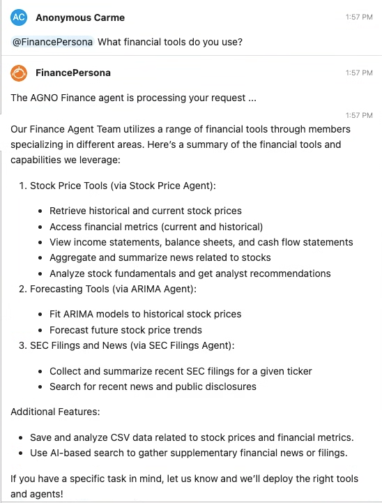
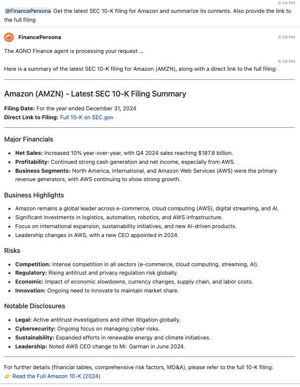
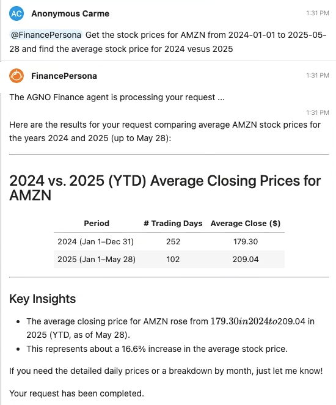
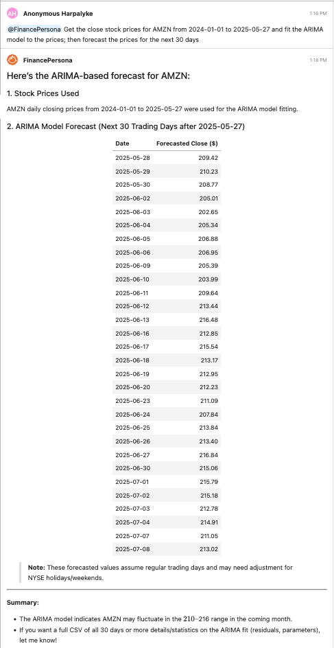

# The Finance Persona

This persona contains examples that showcase financial uses of agentic workflows. It uses APIs and tools from [financial datasets](https://www.financialdatasets.ai). It is based on a multi-agent system that uses the [Agno library](https://github.com/agno-agi/agno) under the hood. The persona is adept at responding to focused natural language instructions to perform various financial analyses and tasks such as collecting data, pricing securities, accessing SEC filings, forecasting, etc. The Persona is extendable with many additional financial analyses.  

The Persona is packaged in a folder titled `finance_persona` as containing the following files:

1. `persona.py`: contains the main code for the persona. 
2. `fd.py`: This contains the `FinancialDatasetsTools` class with several functions and tools.
3. `README.md` file for documenting the finance persona. 
4. Various image files for the documentation.

## Set up

To install Personas, see the [instructions](https://github.com/jupyter-ai-contrib/jupyter-ai-personas/blob/main/README.md#installation).

Personas run with [Jupyter AI](https://github.com/jupyterlab/jupyter-ai), which is automatically installed with the instructions above. You can use Jupyter AI without Personas for many other applications, refer to the [documentation](https://jupyter-ai.readthedocs.io/en/v2/).


## API Keys

The use of this persona requires an API key from Financial Datasets. You can register and find your account to get an API key. It has excellent tools for access to various quantitative and textual data. For details, see the [documentation](https://docs.financialdatasets.ai/introduction). Once you have the API key, enter AI Settings and choose any `TogetherAI` model, when asked for the API key, enter the Financial Datasets API key, as this persona uses The TogetherAI key as a placeholder for the datasets API key. 

You can enter any API keys you need into the AI Settings page in Jupyter AI for any model related to that API key. Once you do this you can change models, but the API key remains stored until you delete it. This persona accesses the stored API keys automatically at run time. 

Make sure you have API keys for the models used by Agno, see the code in `persona_finance.py` where the code used is based on OpenAI's `gpt-4.1` model:
```python
stock_price_agent = Agent(
            role="Get stock prices for a given date range.",
            model=OpenAIChat(id="gpt-4.1"),
            description="Agent to get the stock price information for a ticker.",
            instructions="For a given ticker, please collect the latest stock prices for the date range provided.",
            tools = [
                FinancialDatasetsTools(
                    enable_company_info=False, 
                    enable_prices=True, 
                    api_key=FINANCIAL_DATASETS_API_KEY
                ),
                YFinanceTools(
                    stock_price=True, 
                    analyst_recommendations=True, 
                    stock_fundamentals=True,
                ),
                CsvTools(),
            ],
            show_tool_calls=False,
            markdown=True,
            name = "Stock Price Agent",
        )
```

For reference to usage of LLMs woth Agno, see https://docs.agno.com/models/introduction. 


## Examples

When the Finance Persona is called, it examines the query and determines whether it is related to finance or not. If it is a finance related request, then it hands it off to the multi-agent system to process. If not, it will attempt to generate an answer using the chosen LLM's memory. This behavior can be customized, so that the persona only responds to finance requests.

### Example 1

Ask the agentic system to describe what tools it uses. 



### Example 2

Ask the agentic system to summarize the latest SEC 10-K filing from any company. 



### Example 3

The agent can download stock prices and analyze them. 



### Example 4

The agentic system can be used for forecasting using ARIMA models. 

