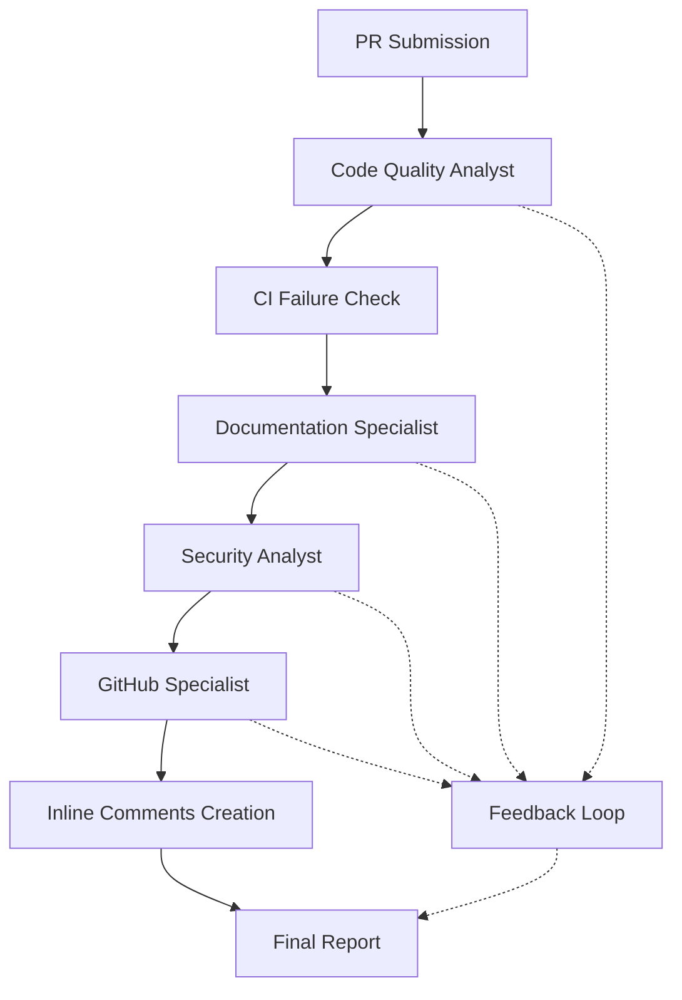

# PR Review Persona for JupyterLab

A specialized pull request review system designed to provide comprehensive code review and feedback in GitHub Pull Requests. This system enhances the Jupyter AI extension and leverages AWS Bedrock models for intelligent PR analysis. This persona leverages Agno Teams comprising multiple Agno Agents. [Agno](https://docs.agno.com/introduction) is a full-stack framework for building Multi-Agent Systems with memory, knowledge and reasoning.

## Work In Progress:
Response is delayed as the persona runs multiple verifications and tests, wait time is between 2 min to 5 min.

## Architecture

The system implements a team-based approach with four specialized agents:

1. **Code Quality Analyst**
   - Reviews code structure and patterns
   - Checks CI status and analyzes failures.
   - Detects code smells and anti-patterns : Potential design or implementation problems, even if the code functions correctly.
   - Evaluates complexity and readability
   - Assesses performance implications
   - Creates inline PR comments for issues found.

2. **Documentation Specialist**
   - Verifies docstrings for new/modified functions and classes
   - Checks README updates for new features or changes
   - Reviews return value documentation
   - Ensures documentation consistency

3. **Security Analyst**
   - Scans for exposed sensitive information (API keys, tokens, credentials)
   - Identifies potential SQL injection vulnerabilities
   - Verifies proper input sanitization
   - Checks for insecure direct object references

4. **GitHub Specialist**
   - Monitors and analyzes GitHub repository activities and changes
   - Fetches and processes pull request data
   - Analyzes code changes and provides structured feedback
   - Identifies issues that need inline comments

## Coordination System

The team members work together through a coordinated workflow:



- The **Code Quality Analyst** leads with comprehensive code review and CI analysis
- The **Documentation Specialist** ensures documentation completeness
- The **Security Analyst** performs security vulnerability assessment
- The **GitHub Specialist** manages repository operations and feedback delivery
- All agents contribute to inline comments and comprehensive reporting

## Features

- **Comprehensive Code Review**: Multi-agent analysis covering quality, security, and documentation
- **CI Integration**: Automatic detection and analysis of CI failures
- **Inline PR Comments**: Direct feedback on specific code lines
- **Security Vulnerability Detection**: Comprehensive security analysis
- **Code Quality Assessment**: Best practices verification and code smell detection
## Technical Details

### Dependencies

- AWS credentials must be properly configured in local configuration file (~/.aws/credentials)
- GitHub Access Token needs to be added to the environment for GitHub operations:
```bash
export GITHUB_ACCESS_TOKEN="ghp_your_token_here"
```

### Implementation

The system is implemented using:
- Team coordination through the `agno.team.Team` class with `coordinate` mode
- AWS Bedrock's Claude model for agent intelligence
- Specialized tools for GitHub operations, CI analysis, and comment creation
- Message history tracking for context awareness

#### File Structure

- **`persona.py`**: Main persona implementation containing the PRReviewPersona class, team initialization, and agent coordination logic
- **`fetch_ci_failures.py`**: Tool for fetching CI failure data from GitHub Actions API, analyzing workflow runs and job failures
- **`pr_comment_tool.py`**: Tool for creating inline PR comments, posting targeted feedback directly on specific code lines
- **`template.py`**: Contains prompt templates and variable definitions for structuring agent instructions and responses

## Usage

The system will automatically coordinate between team members to:
1. Analyze the PR changes and their impact
2. Check CI status and analyze any failures
3. Review code quality and style
4. Perform security audit
5. Create inline comments for specific issues
6. Generate comprehensive feedback with progress updates

### Example 

@PR_ReviewPersona review PR number 3 from the repo https://github.com/jupyter-ai-contrib/jupyter-ai-personas


 

## Configuration

The system uses AWS Bedrock models and requires appropriate AWS credentials and configuration. The model ID and other parameters can be configured through the Jupyter AI extension settings.

## Error Handling

The system implements comprehensive error handling:
- **Configuration Errors**: Validates environment variables and model configuration
- **CI Analysis Errors**: Handles GitHub API failures gracefully
- **Comment Creation Errors**: Manages PR comment posting failures
- **Async Task Errors**: Proper cleanup of heartbeat tasks and threading
- **AWS Bedrock Errors**: Specific handling for model API limitations

## Security Considerations

- File operations are restricted to explicit user requests
- System operates within JupyterLab security context
- GitHub token validation and secure API access
- No sensitive information exposure in logs or responses

## Testing

The system includes comprehensive test coverage:
- **Async Test Support**: Uses pytest-asyncio for async function testing
- **Mock Infrastructure**: Complete mocking of external dependencies
- **CI Integration**: GitHub Actions workflow for automated testing
- **Cross-Platform Support**: Tests run on multiple Python versions